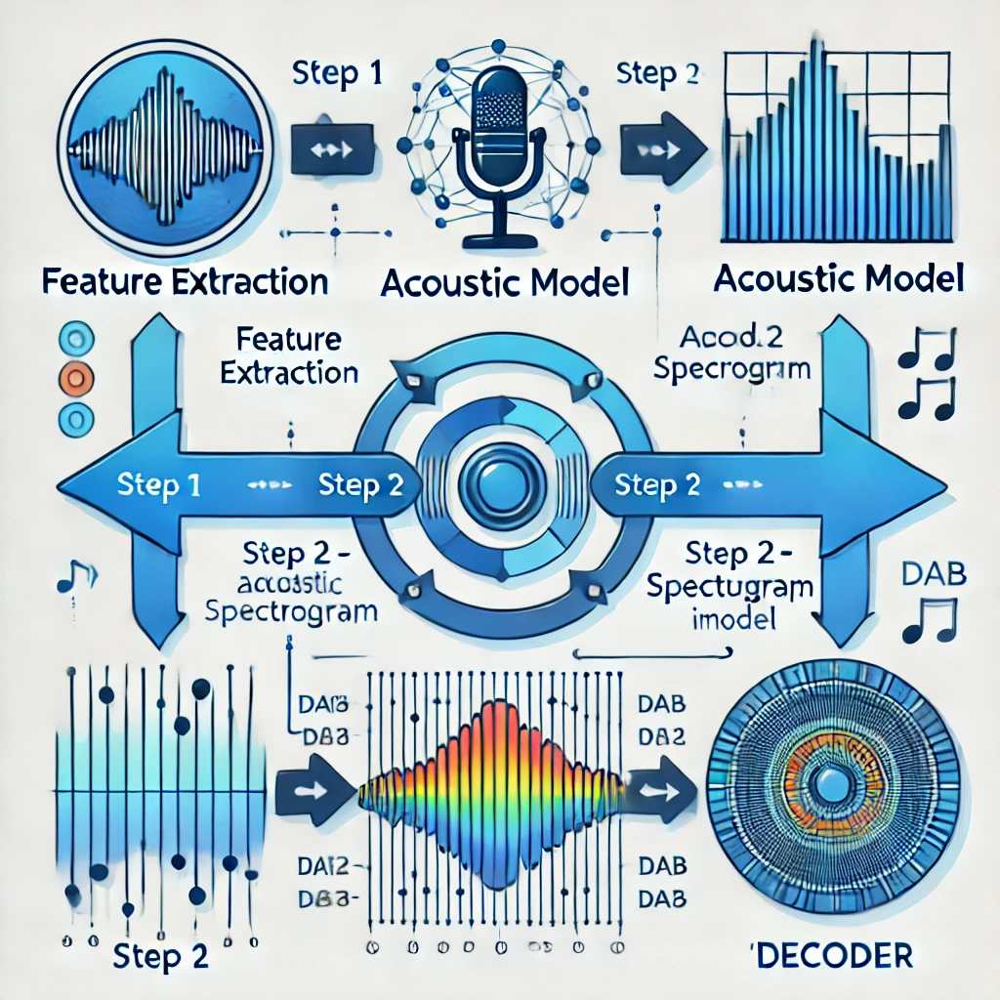
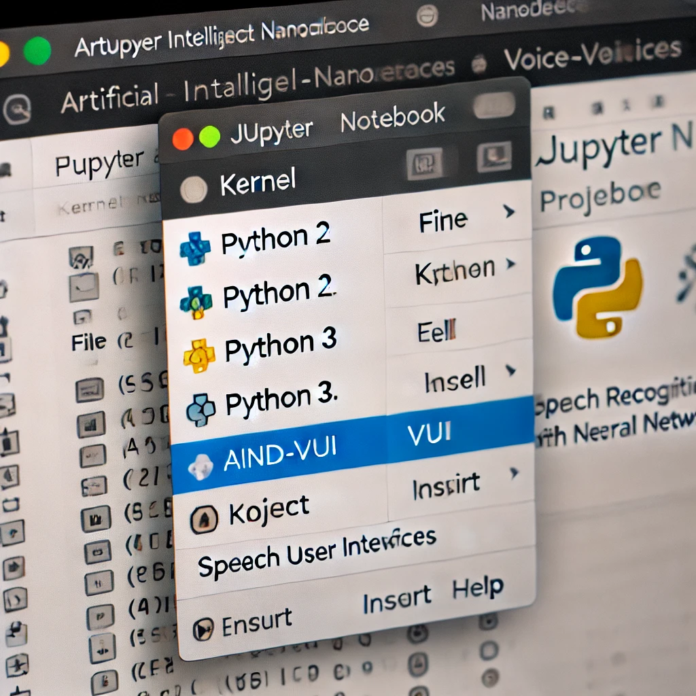

# AutomaticSpeechRecognition
This project will delve into audio data processing and visualization techniques. We'll assess the model's performance using the Word Error Rate (WER) metric and ultimately deploy the finalized AI model. Leveraging TensorFlow and Python, we'll explore audio processing and spectrogram computation, implementing our findings to develop a fully functional solution. This comprehensive deep learning endeavor encompasses all stages involved in constructing a practical model from start to finish.

We will build a deep neural network that functions as part of an end-to-end automatic speech recognition (ASR) pipeline!




This project focuses on building and evaluating neural network models for Automatic Speech Recognition (ASR) using the **LibriSpeech dataset**. The process begins by converting raw audio into feature representations suitable for ASR tasks. Neural networks are then designed to map these features to their corresponding transcriptions. Along the way, you will explore different types of layers commonly used in deep learning-based ASR models, and experiment with creating and testing your own state-of-the-art architectures.

To support your learning, the repository provides links to recommended research papers and GitHub repositories with relevant implementations.

---

## Project Instructions

### **Getting Started**
1. Clone the repository and navigate to the project folder:
   ```bash
   git clone https://github.com/udacity/AIND-VUI-Capstone.git
   cd AIND-VUI-Capstone
   
2. Create and Activate a New Environment
Set up a Python environment with version 3.6 and the numpy package:

   * Linux or Mac:
    ```
    conda create --name aind-vui python=3.5 numpy
    source activate aind-vui
    ``` 
   
   * Widows:
    ```
    conda create --name aind-vui python=3.6 numpy scipy
    activate aind-vui
    ``` 
3. Install TensorFlow:

   * Option 1 (GPU support): Follow this guide to set up NVIDIA software. If using the Udacity AMI, only install tensorflow-gpu:
    ```
   pip install tensorflow-gpu==1.1.0
    ``` 
   
   * Option 2 (CPU only):
    ```
    pip install tensorflow==1.1.0
    ``` 
   
4. Install required pip packages:

   ```
   pip install tensorflow-gpu==1.1.0
    ``` 

5. Configure Keras to use TensorFlow backend:

   * Linux/Mac:
    ```
   KERAS_BACKEND=tensorflow python -c "from keras import backend"
    ``` 
   
   * Windows:
    ```
    set KERAS_BACKEND=tensorflow
    python -c "from keras import backend"
    ```
   
6. Install the ` libav ` package:

   * Linux: ` sudo apt-get install libav-tools ` 
   * Mac: ` brew install libav `
   * Windows: Follow Libav instructions and add it to your PATH.


7. Download and preprocess the LibriSpeech dataset:

   * Linux/Mac:
    ```
   wget http://www.openslr.org/resources/12/dev-clean.tar.gz
    tar -xzvf dev-clean.tar.gz
    wget http://www.openslr.org/resources/12/test-clean.tar.gz
    tar -xzvf test-clean.tar.gz
    mv flac_to_wav.sh LibriSpeech
    cd LibriSpeech
    ./flac_to_wav.sh

    ``` 
   
   * Windows: Download the files (dev-clean and test-clean), extract them, and run
    ```
    move flac_to_wav.sh LibriSpeech
    cd LibriSpeech
    powershell ./flac_to_wav.sh

    ``` 
   

8. Create JSON files for training and validation datasets:

    ```
   cd ..
    python create_desc_json.py LibriSpeech/dev-clean/ train_corpus.json
    python create_desc_json.py LibriSpeech/test-clean/ valid_corpus.json

    ``` 
   
   * Set up the aind-vui IPython kernel and open the notebook:
    ```
    python -m ipykernel install --user --name aind-vui --display-name "aind-vui"
    jupyter notebook vui_notebook.ipynb
    
    ``` 
   
8. In the notebook, select the aind-vui kernel from the drop-down menu and follow the instructions.




## Project Rubric

### Files Submitted

| **Criteria**            | **Meets Specifications**                                                                 |
|--------------------------|-----------------------------------------------------------------------------------------|
| **Submission Files**     | The submission includes all required files.                                             |

---

### STEP 2: Model 0: RNN

| **Criteria**             | **Meets Specifications**                                                                 |
|--------------------------|-----------------------------------------------------------------------------------------|
| **Trained Model 0**      | The submission trained the model for at least 20 epochs, and none of the loss values in `model_0.pickle` are undefined. The trained weights for the model specified in `simple_rnn_model` are stored in `model_0.h5`. |

---

### STEP 2: Model 1: RNN + TimeDistributed Dense

| **Criteria**             | **Meets Specifications**                                                                 |
|--------------------------|-----------------------------------------------------------------------------------------|
| **Completed `rnn_model` Module** | The submission includes a `sample_models.py` file with a completed `rnn_model` module containing the correct architecture. |
| **Trained Model 1**      | The submission trained the model for at least 20 epochs, and none of the loss values in `model_1.pickle` are undefined. The trained weights for the model specified in `rnn_model` are stored in `model_1.h5`. |

---

### STEP 2: Model 2: CNN + RNN + TimeDistributed Dense

| **Criteria**             | **Meets Specifications**                                                                 |
|--------------------------|-----------------------------------------------------------------------------------------|
| **Completed `cnn_rnn_model` Module** | The submission includes a `sample_models.py` file with a completed `cnn_rnn_model` module containing the correct architecture. |
| **Trained Model 2**      | The submission trained the model for at least 20 epochs, and none of the loss values in `model_2.pickle` are undefined. The trained weights for the model specified in `cnn_rnn_model` are stored in `model_2.h5`. |

---

### STEP 2: Model 3: Deeper RNN + TimeDistributed Dense

| **Criteria**             | **Meets Specifications**                                                                 |
|--------------------------|-----------------------------------------------------------------------------------------|
| **Completed `deep_rnn_model` Module** | The submission includes a `sample_models.py` file with a completed `deep_rnn_model` module containing the correct architecture. |
| **Trained Model 3**      | The submission trained the model for at least 20 epochs, and none of the loss values in `model_3.pickle` are undefined. The trained weights for the model specified in `deep_rnn_model` are stored in `model_3.h5`. |

---

### STEP 2: Model 4: Bidirectional RNN + TimeDistributed Dense

| **Criteria**             | **Meets Specifications**                                                                 |
|--------------------------|-----------------------------------------------------------------------------------------|
| **Completed `bidirectional_rnn_model` Module** | The submission includes a `sample_models.py` file with a completed `bidirectional_rnn_model` module containing the correct architecture. |
| **Trained Model 4**      | The submission trained the model for at least 20 epochs, and none of the loss values in `model_4.pickle` are undefined. The trained weights for the model specified in `bidirectional_rnn_model` are stored in `model_4.h5`. |

---

### STEP 2: Compare the Models

| **Criteria**             | **Meets Specifications**                                                                 |
|--------------------------|-----------------------------------------------------------------------------------------|
| **Question 1**           | The submission includes a detailed analysis of why different models might perform better than others. |

---

### STEP 2: Final Model

| **Criteria**             | **Meets Specifications**                                                                 |
|--------------------------|-----------------------------------------------------------------------------------------|
| **Completed `final_model` Module** | The submission includes a `sample_models.py` file with a completed `final_model` module containing a final architecture that is not identical to any of the previous architectures. |
| **Trained Final Model**  | The submission trained the model for at least 20 epochs, and none of the loss values in `model_end.pickle` are undefined. The trained weights for the model specified in `final_model` are stored in `model_end.h5`. |
| **Question 2**           | The submission includes a detailed description of how the final model architecture was designed. |
